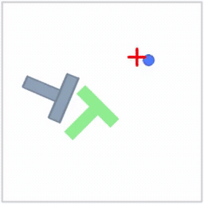

# 2. Action Chunking with MSE Loss

Implementation and training of an **MSE-based action chunking policy** for the Push-T imitation learning assignment.

## Overview

The policy is an MLP that takes a `state` as input and predicts the next **`chunk_size` consecutive actions (an action chunk)** in a single forward pass. Training is a regression that fits the expert demonstration action chunks as targets using an **MSE loss**.

- `state_dim` → MLP → output of size `chunk_size * action_dim`, reshaped to `(batch, chunk_size, action_dim)`
- In this assignment: `action_dim = 2`, `chunk_size = 8` → output dim `16`
- Hidden layers `hidden_dims = (256, 256, 256)`, ReLU activation

## Implementation

### `model.py` — `MSEPolicy`

| Method | Implementation |
|--------|----------------|
| `__init__` | Build a dims list `[state_dim, *hidden_dims, output_dim]`, then stack `nn.Linear` + `nn.ReLU` into an `nn.Sequential` (no ReLU after the final layer) |
| `compute_loss` | Reshape the prediction to `(batch, chunk_size, action_dim)`, return MSE `((pred - target)**2).mean()` |
| `sample_actions` | At inference, take only the state, forward pass → reshape → return the action chunk |

```python
def compute_loss(self, state, action_chunk):
    pred = self.net(state)
    pred = pred.reshape(-1, self.chunk_size, self.action_dim)
    return ((pred - action_chunk) ** 2).mean()
```

### `train.py` — Training loop

- Optimizer: `AdamW` (`lr=3e-4`, `weight_decay=0.0`)
- Each step: `compute_loss` → `zero_grad` → `backward` → `step`
- `tqdm` progress bar showing per-epoch progress and live loss
- Every `eval_interval`, run `evaluate_policy` for environment rollouts + checkpoint saving
- On completion, `logger.dump_for_grading()` produces the grading bundle

## Results

- **train loss ≈ 0.017** at convergence
- **eval mean reward ≈ 0.62** (mean of per-episode max reward over 100 episodes)
- Training metrics, rollout videos, and checkpoints logged to wandb

## Rollout Videos

The trained policy pushing the block toward the goal in the Push-T environment, comparing performance across training amounts.

**After 10,000 steps**


**After 100,000 steps**



> GIFs above auto-play inline on GitHub. Full-quality MP4: [10,000 steps](assets/mse_rollout_1.mp4) · [100,000 steps](assets/mse_rollout_2.mp4)
