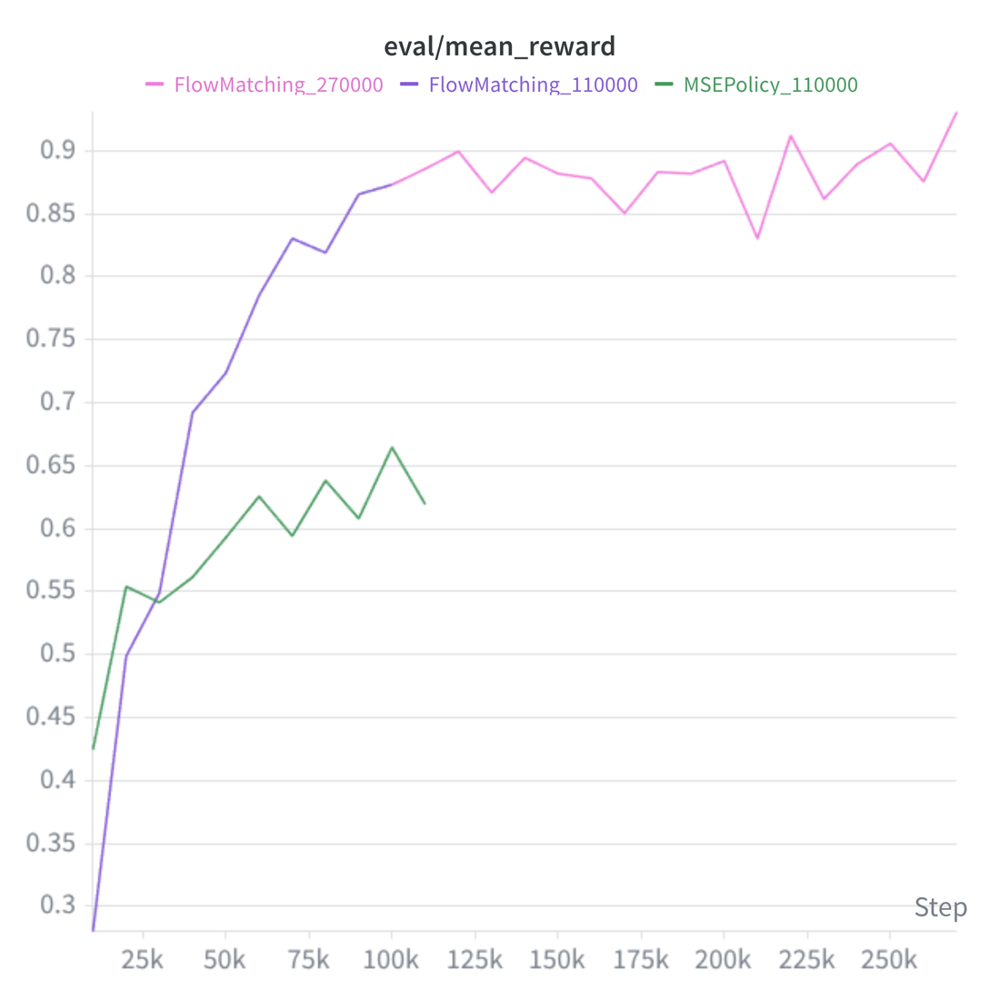
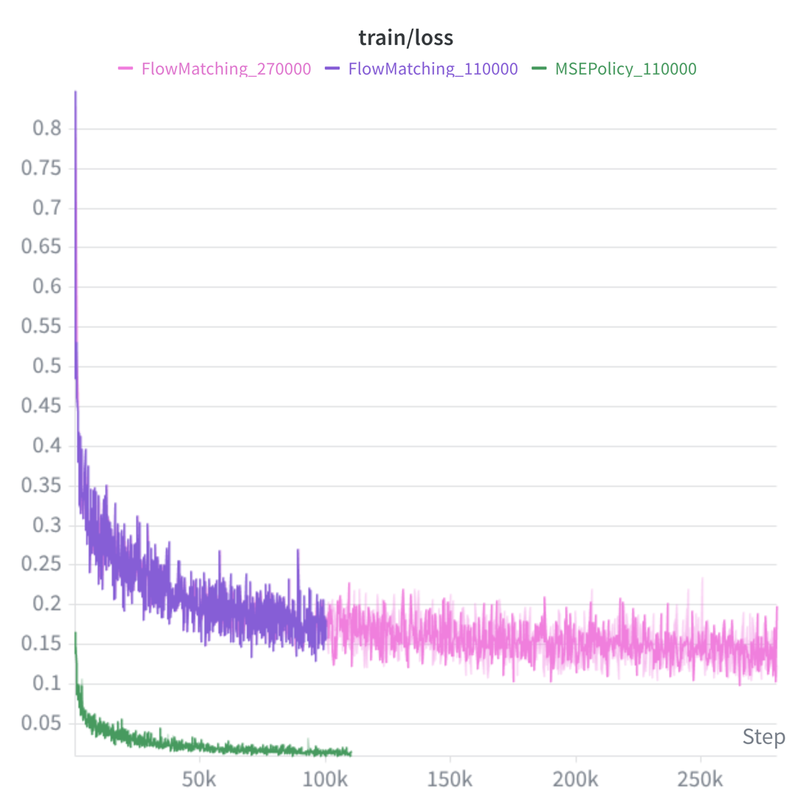
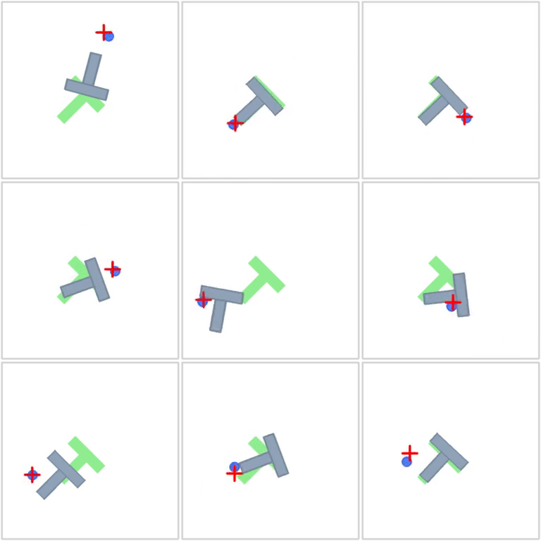
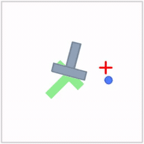
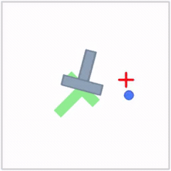
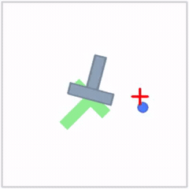

# 3. Action Chunking with Flow Matching

Implementation and training of a **flow matching action chunking policy** for the Push-T imitation learning assignment, and a comparison against the MSE policy from Part 2.

## Overview

An MSE policy predicts a chunk in a single shot, so it collapses a multimodal action distribution to its **mean** — which can produce hedged, imprecise motion. Flow matching instead learns a **conditional vector field (velocity)** that transports noise into a realistic action chunk, similar to diffusion policy. This models the full distribution and generally performs better.

- Let `A` be the expert action chunk and `A_0 ~ N(0, I)` noise of the same shape.
- Sample a timestep `τ ~ U(0, 1)` and interpolate `A_τ = τ·A + (1 − τ)·A_0`.
- A network `v_θ` is trained to predict the velocity `A − A_0` from `(state, A_τ, τ)`.
- At inference, start from noise and integrate the ODE from `τ=0` to `τ=1` with Euler steps.

The MLP is the same as the MSE policy, but the **input now also includes the noisy chunk and the timestep**:

- input dim `= state_dim + chunk_size * action_dim + 1` (state + flattened `A_τ` + `τ`)
- output dim `= chunk_size * action_dim` (the velocity, same shape as a chunk)
- Hidden layers `hidden_dims = (256, 256, 256)`, ReLU activation

## Implementation

### `model.py` — `FlowMatchingPolicy`

| Method | Implementation |
|--------|----------------|
| `__init__` | Same MLP as `MSEPolicy`, but the first layer takes `state_dim + chunk_size*action_dim + 1` inputs (adds the noisy chunk and `τ`) |
| `compute_loss` | Sample noise and per-sample `τ`, interpolate `A_τ`, build the network input by concatenating `[state, flat(A_τ), τ]`, and regress the predicted velocity onto the target `A − A_0` with MSE |
| `sample_actions` | Start from `N(0, I)` noise and run `num_steps` Euler updates `A ← A + (1/num_steps)·v_θ(state, A, τ)` from `τ=0` to `τ=1` |

```python
def compute_loss(self, state, action_chunk):
    A = action_chunk
    A_0 = torch.randn_like(A)
    batch = A.shape[0]
    tau = torch.rand(batch, 1, 1, device=A.device)          # per-sample timestep
    A_tau = tau * A + (1 - tau) * A_0                        # interpolate noise -> data
    inp = torch.cat([state, A_tau.reshape(batch, -1), tau.reshape(batch, 1)], dim=-1)
    v_pred = self.net(inp).reshape(-1, self.chunk_size, self.action_dim)
    target = A - A_0                                         # constant velocity along the line
    return ((v_pred - target) ** 2).mean()

def sample_actions(self, state, *, num_steps=10):
    batch = state.shape[0]
    A = torch.randn(batch, self.chunk_size, self.action_dim, device=state.device)
    dt = 1.0 / num_steps
    for i in range(num_steps):                              # Euler integration tau: 0 -> 1
        tau = torch.full((batch, 1), i * dt, device=state.device)
        inp = torch.cat([state, A.reshape(batch, -1), tau], dim=-1)
        v = self.net(inp).reshape(batch, self.chunk_size, self.action_dim)
        A = A + dt * v
    return A
```

### `train.py` — Training loop

The training loop is **policy-agnostic and unchanged from Part 2** — it just calls `compute_loss` / `sample_actions`. Train the flow policy with `--policy_type flow` (inference uses `flow_num_steps` Euler steps, default 10).

## Results

Three runs compared: **MSE @ 110k**, **Flow @ 110k**, **Flow @ 270k** steps.





| Run | final mean reward | target ≥ 0.70 |
|-----|:-----------------:|:-------------:|
| MSE · 110k | ≈ 0.62 (peak ≈ 0.66) | ❌ not reached |
| Flow · 110k | ≈ 0.87 | ✅ passed |
| Flow · 270k | ≈ 0.90+ (0.85–0.93) | ✅ passed |

- At the **same 110k steps**, Flow (0.87) far exceeds MSE (0.62). Flow crosses the 0.70 target around ~45k steps; MSE never reaches it.
- Training Flow to **270k** pushes reward to **0.90+**, with diminishing returns (loss stays roughly flat).

> ⚠️ **The loss values are not directly comparable across methods.** MSE loss measures *action* prediction error (≈0.02); flow loss measures *velocity* prediction error (≈0.15). A lower loss does **not** mean a better policy — judge performance by reward.

## Qualitative Comparison

Final states of three fixed-seed episodes (columns: MSE 110k · Flow 110k · Flow 270k; rows: ep0–2). The gray T should be seated onto the green target.



- **MSE · 110k** — leaves the T **tilted / partially overlapping**; averaging multimodal demos yields hedged, imprecise placement.
- **Flow · 110k** — usually seats the T accurately, but is **not yet fully consistent** (e.g. ep1 drifts off target).
- **Flow · 270k** — seats the T well across **all** episodes; longer training improves consistency and precision.

## Rollout Videos (Episode 0)

| MSE · 110k | Flow · 110k | Flow · 270k |
|:----------:|:-----------:|:-----------:|
|  |  |  |

> GIFs auto-play inline on GitHub. For the **full interactive report** (all 9 rollouts, playable MP4, both charts), open [`flow_matching_vs_mse.html`](flow_matching_vs_mse.html) in this folder.
